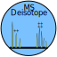

A Library for Deisotoping and Charge State Deconvolution For Mass Spectrometry
------------------------------------------------------------------------------

This library combines `brainpy` and `ms_peak_picker` to build a toolkit for
MS and MS/MS data. The goal of these libraries is to provide pieces of the puzzle
for evaluating MS data modularly. The goal of this library is to combine the modules
to streamline processing raw data.

API
---

Data Access
===========

``ms_deisotope`` can read from mzML, mzXML and MGF files directly, using the ``pyteomics`` library.
On Windows, it can also use ``comtypes`` to access Thermo's MSFileReader.dll to read RAW files and
Agilent's MassSpecDataReader.dll to read .d directories. Whenever possible, the library provides a
common interface to all supported formats.

.. code:: python

    from ms_deisotope import MSFileReader
    from ms_deisotope.data_source import mzxml

    # open a file, selecting the appropriate reader automatically
    reader = MSFileReader("path/to/data.mzML")

    # or specify the reader type directly
    reader = mzxml.MzXMLLoader("path/to/data.mzXML")

All supported readers provide fast random access for uncompressed files, and support the Iterator
interface.

.. code:: python

    # jump the iterator to the MS1 scan nearest to 30 minutes into the run
    reader.start_from_scan(rt=30)

    # read out the next MS1 scans and all associated MSn scans
    scan_bunch = next(reader)
    print(scan_bunch.precursor, len(scan_bunch.products))

Averagine
=========

An "Averagine" model is used to describe the composition of an "average amino acid",
which can then be used to approximate the composition and isotopic abundance of a
combination of specific amino acids. Given that often the only solution available is
to guess at the composition of a particular *m/z* because there are too many possible
elemental compositions, this is the only tractable solution.

This library supports arbitrary Averagine formulae, but the Senko Averagine is provided
by default: `{"C": 4.9384, "H": 7.7583, "N": 1.3577, "O": 1.4773, "S": 0.0417}`

.. code:: python

    from ms_deisotope import Averagine
    from ms_deisotope import utils

    peptide_averagine = Averagine({"C": 4.9384, "H": 7.7583, "N": 1.3577, "O": 1.4773, "S": 0.0417})
    
    utils.draw_peaklist(peptide_averagine.isotopic_cluster(1266.321, charge=1))

